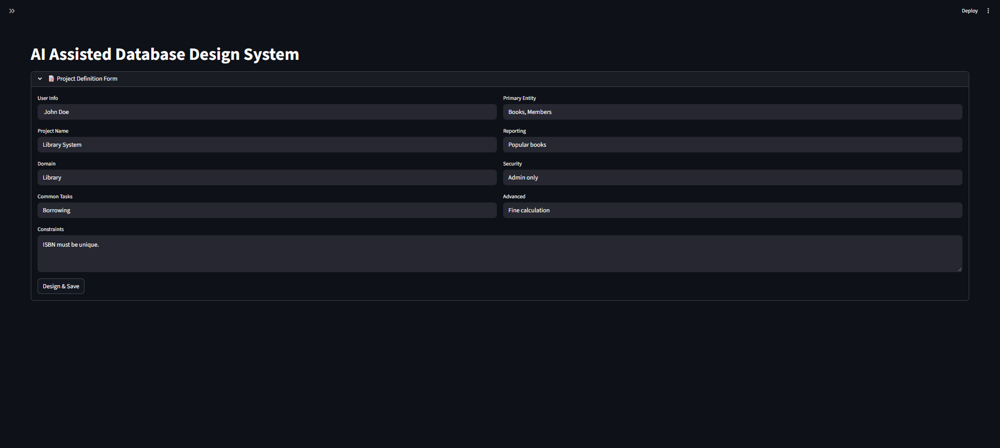
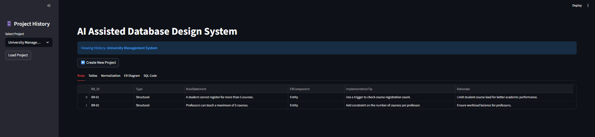
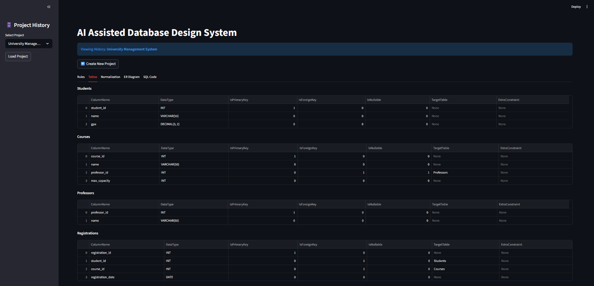
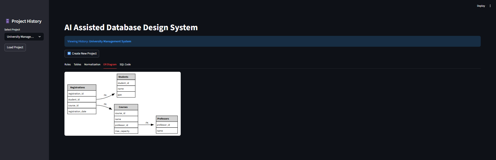
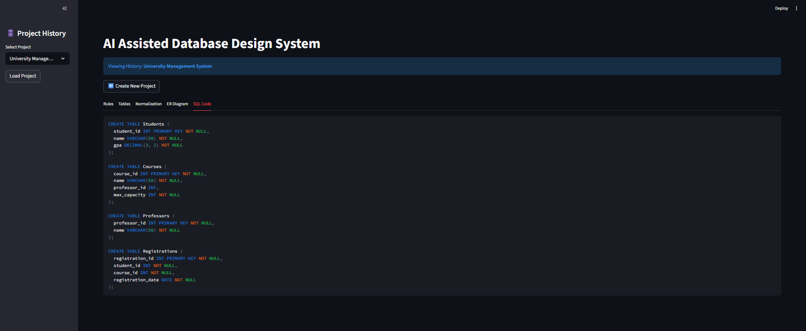

## 📸 Project Screenshots

### 1. Project Definition (Input)
The user defines the project domain, primary entities, and constraints using natural language.

### 2. Business Rules Extraction
The AI analyzes the input to extract Structural and Operational business rules automatically.

### 3. Database Schema Design (Tables)
The system generates normalized database tables with appropriate data types and keys.

### 4. Entity-Relationship Diagram (ERD)
A visual representation of the database schema using standard Crow's Foot notation.

### 5. SQL Code Generation
Final output includes ready-to-deploy SQL scripts with CREATE TABLE statements, constraints, and triggers.
